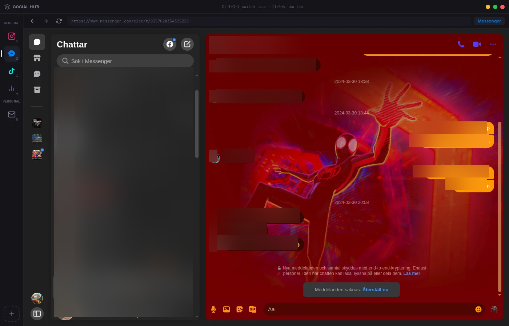
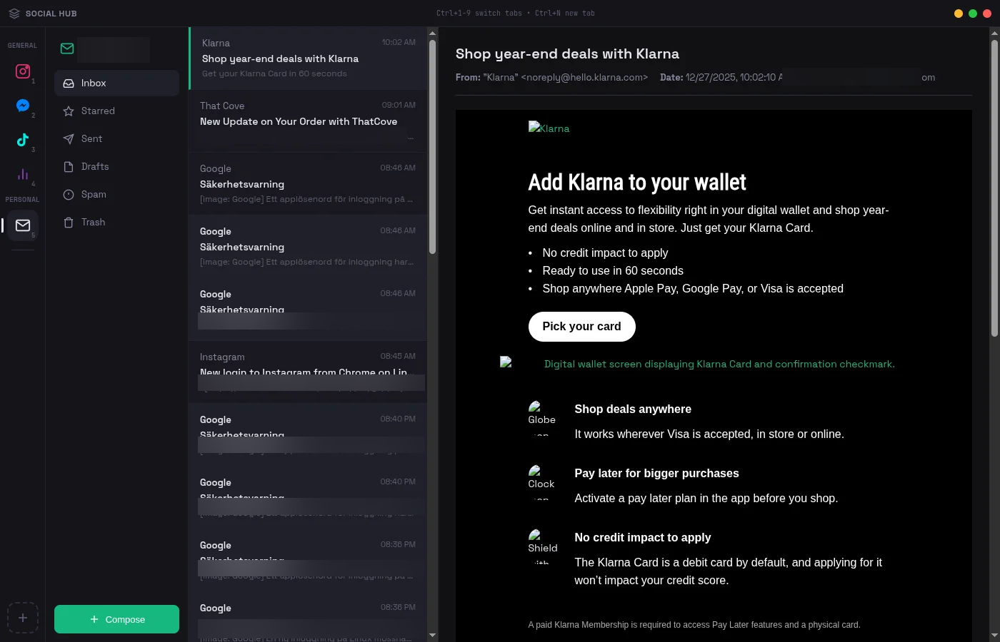
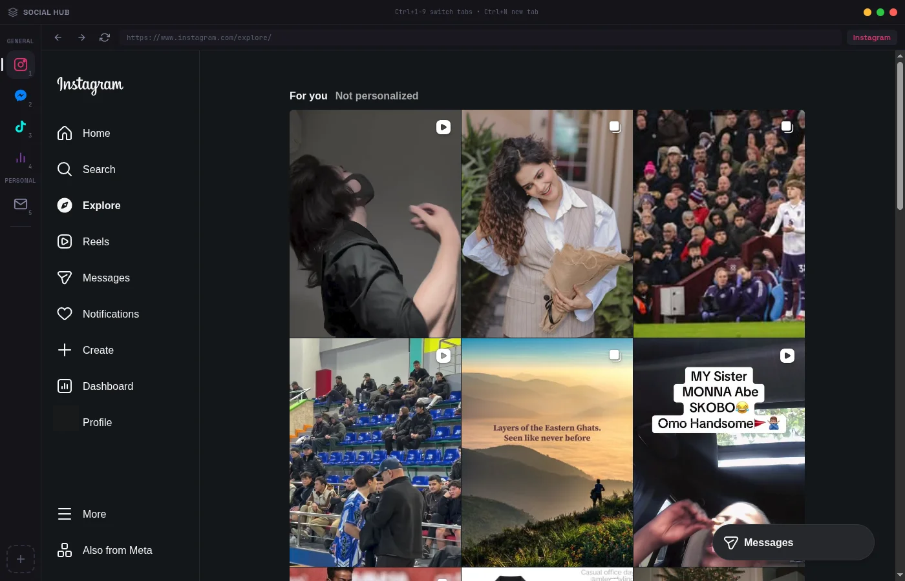
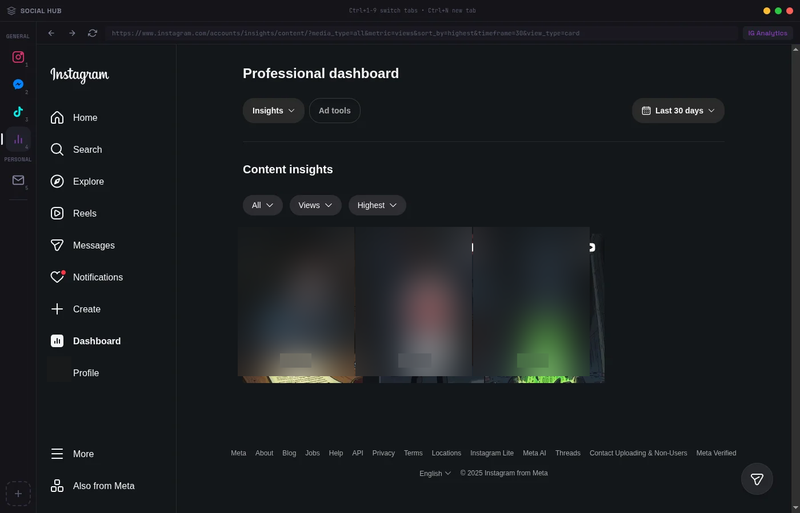
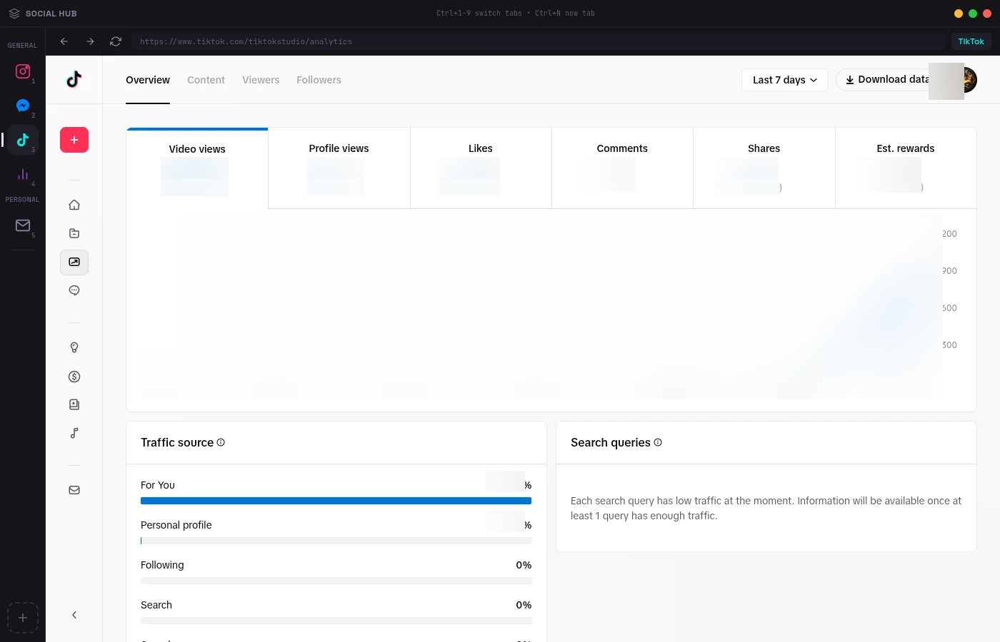

# Social Hub

A unified desktop application for managing multiple social media accounts and email in one place. Built with Electron.



## Features

- **Multi-Account Support** - Add multiple accounts for each service, each with isolated sessions
- **Tab Groups** - Organize tabs into General, Work, and Personal groups
- **Tab Renaming** - Customize tab names for easy identification
- **Keyboard Shortcuts** - Quick navigation with Ctrl+1-9, Ctrl+N, Ctrl+W
- **Notification Badges** - See unread counts at a glance
- **Persistent Sessions** - Stay logged in across app restarts

## Supported Services

### Social
- **Messenger** - Facebook chat & comments
- **Instagram** - DMs, explore, and analytics
- **TikTok** - Analytics and content management

### Email
- **Email (IMAP)** - Gmail, Outlook, Yahoo, iCloud with App Passwords
- **Outlook Web** - Microsoft webmail

### Custom
- Add any website as a custom tab

## Screenshots

### Messenger


### Email (IMAP)


### Instagram


### Instagram Analytics


### TikTok Analytics


## Installation

### From Source

```bash
# Clone the repository
git clone https://github.com/mosshansson/social-hub.git
cd social-hub

# Install dependencies
npm install

# Run the app
npm start
```

### Build for Distribution

```bash
# Build for current platform
npm run build

# Build for specific platforms
npm run build:win    # Windows
npm run build:linux  # Linux
```

## Keyboard Shortcuts

| Shortcut | Action |
|----------|--------|
| `Ctrl+1-9` | Switch to tab 1-9 |
| `Ctrl+N` | Add new tab |
| `Ctrl+W` | Close current tab |
| `Ctrl+R` | Reload current tab |
| `Ctrl+Tab` | Next tab |
| `Ctrl+Shift+Tab` | Previous tab |

## Email Setup (IMAP)

For Gmail and other providers that require app passwords:

1. Enable 2-Factor Authentication on your email account
2. Generate an App Password:
   - [Gmail App Passwords](https://myaccount.google.com/apppasswords)
   - [Outlook App Passwords](https://account.live.com/proofs/AppPassword)
3. Use the App Password in Social Hub (not your regular password)

## Tech Stack

- **Electron** - Cross-platform desktop framework
- **Node.js** - Runtime
- **IMAP/SMTP** - Email protocols via `imap` and `nodemailer`

## Privacy

- All login sessions are stored locally on your machine
- Email credentials are saved in your user data directory
- No data is sent to external servers (except to the services you connect to)

## License

MIT License - see [LICENSE](LICENSE) for details.

## Contributing

Contributions are welcome! Please feel free to submit a Pull Request.
